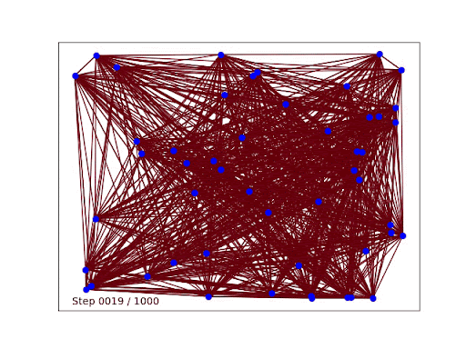

# DIFUSCO: Graph-based Diffusion Solvers for Combinatorial Optimization

See ["DIFUSCO: Graph-based Diffusion Solvers for Combinatorial Optimization"](https://arxiv.org/abs/2302.08224) for the paper associated with this codebase.


<div align="center">
    
  
</div>

## Setup

```bash
conda env create -f environment.yml
conda activate difusco
```

Running TSP experiments requires installing the additional cython package for merging the diffusion heatmap results:

```bash
cd difusco/utils/cython_merge
python setup.py build_ext --inplace
cd -
```

## Codebase Structure

* `difusco/pl_meta_model.py`: the code for a meta pytorch-lightning model for training and evaluation.
* `difusco/pl_tsp_model.py`: the code for the TSP problem
* `difusco/pl_mis_model.py`: the code for the MIS problem
* `difusco/trian.py`: the handler for training and evaluation

## Data

Please check the `data` folder.

## Reproduction

Please check the [reproducing_scripts](reproducing_scripts.md) for more details.

## Pretrained Checkpoints

Please download the pretrained model checkpoints from [here](https://drive.google.com/drive/folders/1IjaWtkqTAs7lwtFZ24lTRspE0h1N6sBH?usp=sharing).

## Reference

If you found this codebase useful, please consider citing the paper:

```
@inproceedings{
    sun2023difusco,
    title={{DIFUSCO}: Graph-based Diffusion Solvers for Combinatorial Optimization},
    author={Zhiqing Sun and Yiming Yang},
    booktitle={Thirty-seventh Conference on Neural Information Processing Systems},
    year={2023},
    url={https://openreview.net/forum?id=JV8Ff0lgVV}
}
```
